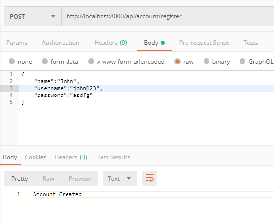
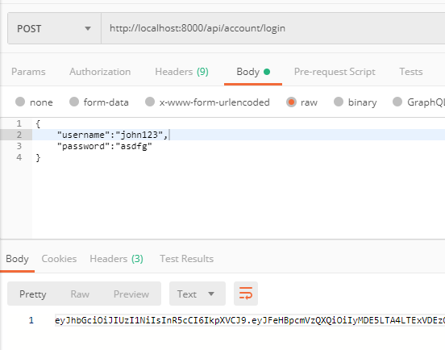
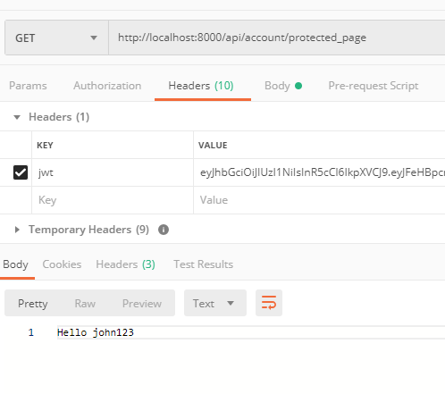
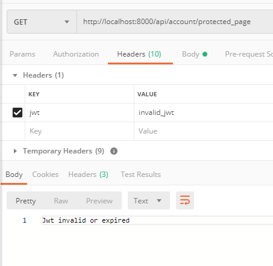

# Go JWT Authorization and Authentication

## Project Overview

This project is a demo project which showcase the use of JWT to protect an endpoint. The project utilizes `LevelDB` to store the user details.

The project comes with a complete test suite which include unit testing and integration testing

## Installation

Clone this repo

```
git clone https://github.com/albertsundjaja/go_auth_endpoint.git
```

go into the cloned `go_auth_endpoint` folder

to run the server type in the terminal

```
go run main.go
```

this project is developed and tested using `go1.12.7`, errors might be caused by using earlier version of Go

## Database

In order to make the project demo easier to run, `LevelDB` is used instead of other SQL or NoSQL database
`LevelDB` is a high performance key-value pairs database developed by Google

There is no need to install the LevelDB separately, as `go module` will automatically install all the dependencies

## Unit Testing

to run the test suite

```
go test -v ./...
```

## API Endpoint

### Registration

```
POST /api/account/register
```

The endpoint requires sending a JSON request as below to register a new user

##### Request

```
{
	"name":"string",
    "username": "string",
    "password": "string"
}
```

##### Possible Response

```
// Success
HTTP 201
Body: Account Created

// Internal Server Error
HTTP 500
Body: error msg
```

### Login

```
POST /api/account/login
```

The endpoint requires user to send a JSON request and it will return back a JWT to be used for authentication and authorization

##### Request

```
{
	"username":"string",
    "password":"string
}
```

##### Possible Response

```
// Success
HTTP 200
Body: JWT string

// Wrong Username Password
HTTP 401
Body: error msg

// Internal Server Error
HTTP 500
Body: error msg
```

### Protected Endpoint

```
GET /api/account/protected_page
```

This is the supposed to be secure endpoint, it needs user to supply a jwt header key `jwt: JWT string` to access

##### Request

```
Header
jwt: jwt string
```

##### Possible Response
```
// Success
HTTP 200
Body: Hello <username>

// Invalid JWT
HTTP 401
Body: error msg

// Internal Server Error
HTTP 500
Body: error msg
```

## Demo

The quickest way to test the endpoint is by using `postman`

### Registration



### Login


### Accessing Protected Page with Correct JWT



### Accessing Protected Page with Incorrect JWT




